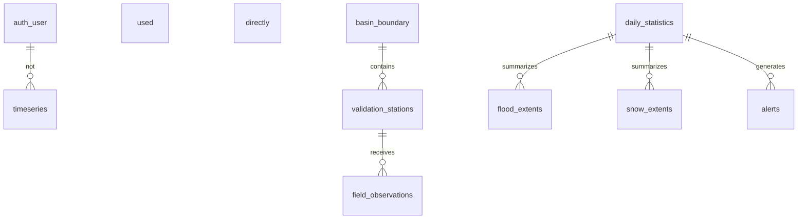

# ERD

Cette page documente erd dans le cadre de la section Database.

## Vue relationnelle simplifiée

## Note de conception

Les vues `api.*` encapsulent les modèles de lecture de l'application; les tables `sebou.*` stockent les sorties et indicateurs thématiques.

## Lecture exécutive

Cette page de la section Database approfondit erd à partir du code réel.

## Ce que la page couvre

- les éléments observés dans le dépôt
- les routes, composants, services ou données réellement présents
- les usages métier et techniques sans invention de workflow

## Références internes

| Catégorie | Référence réelle | Intérêt |
| --- | --- | --- |
| Frontend | hydro-sentinel/src/App.tsx | navigation, lazy loading et routes protégées |
| Backend | backend/app/api/v1/api.py | routeurs exposés à l'API |
| Données | backend/data/thematic_maps | produits thématiques et assets spatiaux |
| Pipeline | backend/app/sebou_monitoring | préparation, détection et export |

## Lecture opérationnelle

- la page doit servir la lecture rapide des équipes métier
- les détails techniques doivent rester reliés à des fichiers du projet
- les points d'intégration doivent être clairs pour l'équipe IT

## Points de maintenance

- réexécuter le générateur après une modification du code
- garder les liens et exemples alignés avec les routes réelles
- actualiser les chapitres lorsqu'un composant ou un endpoint évolue
