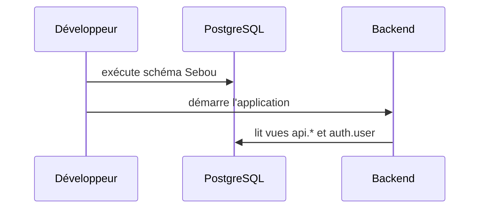

# Initialization And Migrations

Cette page documente initialization and migrations dans le cadre de la section Database.

## Scripts réels

| Fichier | Rôle |
| --- | --- |
| backend/app/db/init_db_final.py | crée auth.user et alimente les comptes |
| backend/app/db/init_db_simple.py | initialisation minimale |
| backend/app/db/sebou_monitoring_schema.sql | création des tables Sebou et des index |
| backend/sql/recap_views.sql | définition des vues de synthèse |

## Règles d'exécution

- l'initialisation finale refuse SQLite
- les scripts doivent être exécutés dans l'ordre du besoin métier
- les migrations ne doivent pas détruire les vues API consommées par le frontend

## Séquence

## Lecture exécutive

Cette page de la section Database approfondit initialization and migrations à partir du code réel.

## Ce que la page couvre

- les éléments observés dans le dépôt
- les routes, composants, services ou données réellement présents
- les usages métier et techniques sans invention de workflow

## Références internes

| Catégorie | Référence réelle | Intérêt |
| --- | --- | --- |
| Frontend | hydro-sentinel/src/App.tsx | navigation, lazy loading et routes protégées |
| Backend | backend/app/api/v1/api.py | routeurs exposés à l'API |
| Données | backend/data/thematic_maps | produits thématiques et assets spatiaux |
| Pipeline | backend/app/sebou_monitoring | préparation, détection et export |

## Lecture opérationnelle

- la page doit servir la lecture rapide des équipes métier
- les détails techniques doivent rester reliés à des fichiers du projet
- les points d'intégration doivent être clairs pour l'équipe IT

## Points de maintenance

- réexécuter le générateur après une modification du code
- garder les liens et exemples alignés avec les routes réelles
- actualiser les chapitres lorsqu'un composant ou un endpoint évolue
